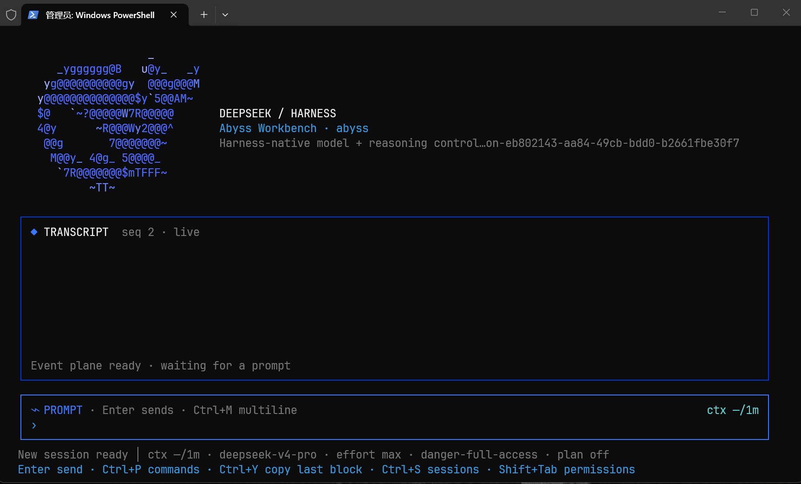

# dsh-tui-app

A full-screen terminal interface (TUI) for DeepSeek Harness (`dsh`), built as an independent, out-of-tree plugin. It runs in the same process as the `dsh` host, reads the durable session event stream directly, and uses host projections only for auxiliary status facts. The Chafa-generated DeepSeek whale is its one visual signature.

<p align="center">
  
</p>

## Features

- **Streaming transcript** — terminal-native Markdown, tool trees, diffs, workflow/job summaries, and raw-event fallback, with grapheme-safe CJK layout.
- **Folded tool output** — tool results render preformatted (never re-flowed as prose) and collapse to a six-line preview that carries the real line count. Arrow keys select any block; `→`/`←` expand and collapse; `Ctrl+E` toggles everything.
- **Row-precise scrollback** — the viewport is a window over rendered terminal lines, not over nodes: one wheel notch always moves three lines, a proportional scrollbar tracks position, streaming appends stay anchored on what you are reading, and a released wheel returns to the pinned live tail.
- **In-place IME composition** — the terminal cursor is parked on the composer caret every frame, so pinyin/pre-edit text composes inside the prompt instead of at the bottom of the screen.
- **Clipboard copy** — `Ctrl+Y` copies the selected block (or the newest one, or the composer's mouse selection) through the terminal's OSC 52 sink and the platform clipboard tool; releasing a transcript drag also copies; `Shift`+drag gives the terminal's native selection; `/mouse` hands the mouse back to the terminal entirely.
- **Stop & take over** — With no overlay open, `Esc` stops a running turn outright. Sending a draft while a turn runs arms the take-over: pressing `Enter` again (or `Esc`) aborts the turn, waits for the driver to go idle, then re-sends the queued drafts so the agent continues with them. Two `Enter`s on an empty composer just stop the turn; `Ctrl+C` is the hard stop that also drops queued drafts. `Esc` on `/` commands (or any other overlay) only closes that overlay.
- **Mouse editing** — click the composer to place the caret (display-cell precise, CJK-safe); drag inside it to select and type to replace; click a transcript row to focus its block; drag across the transcript to select rows and copy on release.
- **Multiline editing & history** — multiline prompts, queued follow-ups, prompt history recall (`↑` on an empty composer; the wheel never recalls history), and explicit step steering.
- **Live model & effort switching** — `/switch` changes the next not-yet-assembled step; `/effort` only offers exact-model levels advertised by the active adapter. Nothing is hard-coded: catalogs and capabilities come from `ctx.llm`.
- **Reasoning disclosure** — Grok-style views over real dsh reasoning events: live tail, stable settled summary, bounded preview, and an independently scrollable detail view.
- **Native structured questions** — the app registers the host's `userQuestions` provider, so a profile that loads `@deepseek-ai/dsh-tool-ask-user` gives the model a working `ask_user_question`: the tool blocks, the QuestionCard collects a keyboard answer, and the answer returns as an ordinary tool result. Only the active root agent may ask; a subagent's request is refused rather than answered on the user's behalf. See [Enabling ask_user_question](#enabling-ask_user_question).
- **Session picker** — `/resume` (and `Ctrl+S`) lists persisted conversations by their durable title (or opening prompt), prompt count, and age, with a current-session marker.
- **Task and conversation timing** — while a turn runs, the header chip counts its elapsed seconds on its own clock; when the turn closes, the chip states that turn's span and the conversation's accumulated task time. Both come from the log's own `turn/start`/`turn/end` timestamps, so a resumed session restates a real total, and a turn Harness never timestamped is not counted rather than estimated.
- **Cache-hit meter** — right under the elapsed chip, the header states the session's cache hit rate: cache-read tokens as a share of billed prompt input over the whole durable log, the same metric the web UI's stats line prints. It stays silent until the log has billed input, and shares the narrow-header budget with the title and the timer.
- **Safe status chrome** — projection-backed footer keeps only short fields (notice, ctx, short model, effort, permission, plan/todos); session ids and cwd live in `/session-info`; secret-like strings are always redacted; secrets and billing are never shown.
- **Themes** — Abyss and Pearl with truecolor, 256-color, 16-color, and monochrome palettes. `auto` safely defaults to Abyss when the terminal background cannot be determined without a blocking query.

## Requirements

- An existing DeepSeek Harness `dsh` launcher with the npm `0.1.0-rc.6` artifact set (this project never downloads or patches Harness)
- Node.js 22 or newer (Node.js 24 is used in CI)
- npm and pnpm for the `dsh plugin` workflow
- Windows Terminal on Windows; modern xterm-compatible terminals are best effort elsewhere

## Installation

```powershell
npm install
npm run build
dsh plugin --profile tui add "C:\absolute\path\to\dsh-tui-app"
dsh --profile tui --help
dsh --profile tui
```

To make a bare `dsh` command open this TUI:

```powershell
powershell -ExecutionPolicy Bypass -File .\scripts\install-default-command.ps1
dsh
```

Explicit commands such as `dsh --help`, `dsh web`, and `dsh plugin ...` remain routed to the upstream CLI. The plugin creates or updates the isolated `tui` profile with `@deepseek-ai/dsh-base` followed by `dsh-tui-app`; it does not edit the Harness checkout.

Resume a durable session:

```powershell
dsh --profile tui --resume <session-id>
```

### Enabling `ask_user_question`

The app provides the question UI, but no dsh bundle loads the tool that lets the
model ask. Add it once to the profile's own patch layer
(`$DSH_HOME/profiles/tui/cordis.patch.yml`) and restart:

```yaml
- insert:
    - id: tool-ask-user
      name: '@deepseek-ai/dsh-tool-ask-user'
```

Confirm the composed tree with `dsh --profile tui --dump-config`, and the whole
path — registration, the card, the returned answer — with `npm run test:ask-user`,
which boots the real profile behind a read-only `--patch` overlay.

Only enable this where a `userQuestions` provider exists: this app registers one,
and the web UI ships `@deepseek-ai/dsh-client-ui-user-questions`. A profile
without a provider (for example the `grok` TUI) fails every call with
`NO_PROVIDER` instead of asking.

## Flags

| Flag | Values | Default |
|---|---|---|
| `--resume <session-id>` | opaque durable session id | new session |
| `--theme <name>` | `abyss`, `pearl`, `auto` | `auto` |
| `--color <mode>` | `truecolor`, `256`, `16`, `mono`, `auto` | `auto` |

`NO_COLOR` always forces monochrome, regardless of `--color`. `/theme abyss|pearl|auto` previews a theme immediately for the current TUI run.

## Slash commands

`/switch [provider/model]`, `/effort [default|level]`, `/model` (a `/switch` alias), `/new`, `/resume`, `/session-info`, `/rename`, `/theme`, `/workflows`, `/mouse`, `/keys`, `/help`, `/quit`.

Commands advertised by dsh execute through the host command registry; exact-name collisions remain visibly separate as `[dsh]` and `[tui]` entries.

## Keyboard reference

| Key | Action |
|---|---|
| `Enter` | send a normal prompt/follow-up; insert newline in multiline mode |
| `Enter` ×2 | with a fresh draft: send, then take over the running turn with it; on an empty composer: stop the running turn |
| `Esc` | stop a running turn; otherwise close an overlay or park a blocking card without answering it |
| `Ctrl+M` / `Alt+Enter` | toggle multiline / send multiline; from transcript, open the model picker |
| `Ctrl+L` | steer the current or next step |
| `Ctrl+W`, `Ctrl+U`, `Ctrl+K` | delete word / to line start / to line end |
| `Ctrl+P` or `?` | open fuzzy dsh + local command palette |
| `Ctrl+S` | open persisted session picker |
| `Ctrl+X` | open the complete in-app key page |
| `Ctrl+Y` | copy the selected block, the composer's mouse selection, or the newest block, to the clipboard |
| `Ctrl+E` | expand/collapse every tool output and reasoning preview |
| `Shift+Tab` | cycle only permission presets advertised by dsh |
| `Tab` | move between composer, blocking card, and transcript |
| `PgUp`, `PgDn` | page the transcript by lines, from either focus |
| `Ctrl+U`, `Ctrl+D` | half-page scroll while transcript is focused |
| `Home` / `End` in transcript | jump to the oldest row / back to the live tail |
| Mouse wheel | scroll the transcript three lines per notch, or walk an open picker; never recalls prompt history |
| `Up` on an empty composer | recall previous prompt after a short pause (wheel bursts are ignored) |
| `Ctrl+Up` / `Ctrl+Down` | recall prompt history immediately |
| `Up`, `Down`, `Left`, `Right`, `Enter` in transcript | select a tool output or reasoning block, fold/expand it, or open full detail |
| Mouse click | composer: move the caret to the clicked cell; transcript: focus the block under the cursor |
| Mouse drag | composer: select text (typing replaces it); transcript: select rows and copy on release |
| `Shift`+drag | the terminal's own selection and copy, unaffected by mouse tracking |
| `Ctrl+C` | cancel a running turn; otherwise clear draft; press twice when idle/empty to quit |

Approvals use `y`/`1` (allow once), `n`/`2` (reject), or `3` (change the real permission preset and then allow once). Questions use arrows, digits, Space for multi-select, `z` for free text, and Enter to advance/submit.

## Web UI comparison

| Capability | dsh-tui | Harness Web UI |
|---|---|---|
| One active root session, new/resume/switch | Yes, picker lists titles and opening prompts | Yes |
| Scrollback | Row-precise window, proportional scrollbar, anchored during streaming | Browser scrolling |
| Streaming messages, tools, diffs, workflows | Terminal-native compact tree | Rich browser presentation |
| Live model + exact-model effort switching | Next unassembled step through `ModelSelectionRef` | Yes |
| Reasoning disclosure | Live tail, settled summary, keyboard detail | Collapsible browser row |
| Long tool output | Preformatted, folded to a sized preview, keyboard-expandable | Collapsible browser panel |
| Copying output | `Ctrl+Y` per block, `Shift`+drag, `/mouse` off | Browser selection |
| Approvals and structured user questions | Keyboard-first, fail-closed | Browser controls |
| Projection status (tokens/context/stats/plan/todos) | Short footer + `/session-info` | Rich panels |
| Themes | Abyss/Pearl + capability fallbacks | Browser theme system |
| CJK and grapheme-safe editing | Yes, Windows Terminal validated | Browser text engine |
| Image/media rendering | Metadata placeholder only | Rich media surfaces |
| In-pane mouse editing | Click-to-caret and drag-select in the composer; click-to-focus and drag-copy in the transcript | Browser selection |
| Transcript search, multi-root dashboard | Not in v1 | Available or better suited to Web UI |
| Remote/browser attachment and DOM slots | Deliberately not used | Native architecture |

## Development

```powershell
npm run check
npm test
npm run build
npm run test:ac:all
```

The full local acceptance requires the existing `dsh` launcher for AC-1 through AC-5. CI runs the static M4 suite on `windows-latest`; real-profile PTY acceptance remains a local/release gate because CI does not install another Harness copy.

`npm run test:timer` is a local-only end-to-end check of the elapsed-time chip: a read-only `--patch` overlay adds a driver that opens and closes two real turns on the real session clock, and the probe asserts the footer counted up once a second while a turn was open and then stated the conversation total that matches the logged spans. Like the check below, it edits nothing under `$DSH_HOME` and deletes the session its own probe created.

`npm run test:ask-user` is a local-only end-to-end check of the native question path: it boots the machine's own `tui` profile with a read-only `--patch` overlay, asserts `ask_user_question` is in the model-facing registry, answers the QuestionCard with real keystrokes, and asserts the tool stayed blocked until it did. It edits nothing under `$DSH_HOME` and deletes the session its own probe created.

## Known limitations

- Windows Terminal is the supported Windows emulator; legacy conhost is best-effort monochrome.
- Block disclosure is keyboard-first, with mouse support for the common gestures: a click places the composer caret or focuses a transcript block, and a drag selects — releasing a transcript drag copies. The terminal's own selection still works via `Shift`+drag, or by handing the mouse back with `/mouse`. The UI displays only reasoning emitted by Harness and never invents completion estimates or activity claims.
- `Ctrl+Y` reports what it attempted, not what the clipboard now holds: OSC 52 delivery is unobservable, and a terminal may refuse it. On Windows the `clip.exe` path is authoritative. Copy takes the block's source text, so a folded preview and an expanded one copy the same thing.
- Assistant messages are still rendered in full; only tool output folds. A model that emits a very long code block in its own answer still prints it.
- Placing the terminal cursor on the composer caret is what lets an IME compose in place. A terminal that ignores cursor positioning keeps the old behavior.
- The session picker folds one durable log per visible row, so a very large stored session costs one read when it scrolls into view. Rows stay sorted by creation time, not by folded last activity, because sorting by activity would require reading every log.
- The elapsed chip times turns, not wall-clock conversation length: the seconds you spend typing between turns are not in the total, and the last-turn/total pair is dropped for the headline number when the header is too narrow to hold both. A turn left open by a failed agent parks the chip on its settled facts instead of counting up forever.
- Multi-line dsh command output (like `/goal`'s status view) folds onto the one-line status footer; re-run the command to read the full text.
- `@` remains ordinary prompt text because rc.6 has no host-safe general attachment-picker seam.
- Images render as attachment labels, not terminal pixels. The whale is a pre-generated ASCII asset.
- No transcript-content search, multi-root dashboard, remote attach, ACP bridge, persistent per-command grants, or invented `/auto` policy.
- Workflow/subagent views are read-only durable summaries. They do not dispatch concurrent root sessions.
- `ask_user_question` is answered only for the active root agent and only one request at a time; a subagent's or a concurrent second request is refused, never auto-answered. The tool is not in any dsh bundle by default — a profile must load it.
- `auto` does not send a blocking terminal-background query; when detection is unreliable it chooses Abyss.

## License & provenance

MIT, see [LICENSE](./LICENSE). Dependency registry integrity values and every consumed host contract are recorded in [PROVENANCE.md](./PROVENANCE.md); setup details and diagnostics are in [INSTALL.md](./INSTALL.md).

This project is independent and is not affiliated with or endorsed by DeepSeek. Logo provenance and trademark boundaries are documented in [NOTICE](./NOTICE).
